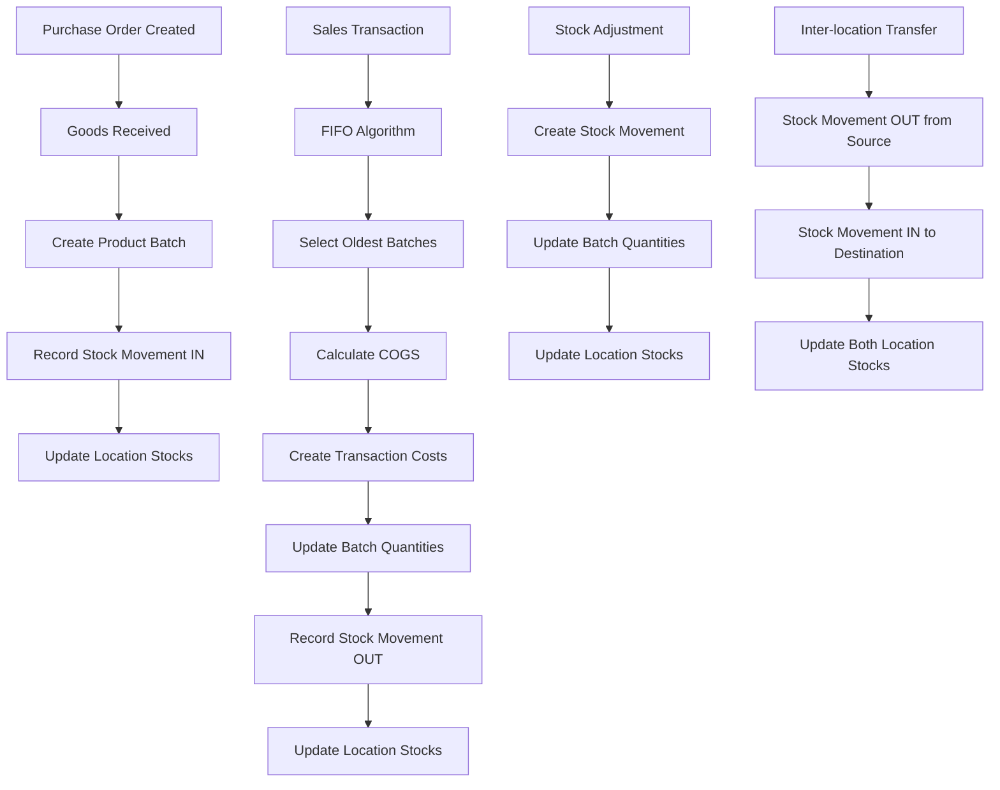

# 🔗 Database Relationship Diagram - Shaka POS

## 📊 Entity Relationship Overview

```mermaid
erDiagram
    %% User Management
    users ||--o{ user_profiles : has
    users ||--o{ activity_logs : creates
    users ||--o{ transactions : performs
    users ||--o{ purchases : creates
    users ||--o{ user_stores : assigned_to
    
    %% Roles & Permissions (Spatie)
    users ||--o{ model_has_roles : has
    roles ||--o{ model_has_roles : assigned_to
    roles ||--o{ role_has_permissions : has
    permissions ||--o{ role_has_permissions : granted_to
    
    %% Master Data
    categories ||--o{ categories : parent_child
    categories ||--o{ products : categorizes
    units ||--o{ units : base_conversion
    units ||--o{ product_units : defines
    
    %% Suppliers
    suppliers ||--o{ purchases : supplies_to
    suppliers ||--o{ product_batches : provides
    
    %% Products & Inventory
    products ||--o{ product_units : has_multiple
    products ||--o{ product_images : has_multiple
    products ||--o{ product_batches : tracked_in
    products ||--o{ stock_movements : moves
    products ||--o{ transaction_items : sold_as
    products ||--o{ purchase_items : purchased_as
    products ||--o{ location_stocks : stored_in
    
    %% FIFO System
    product_batches ||--o{ fifo_transactions : tracked_in
    product_batches ||--o{ transaction_costs : consumed_from
    product_batches ||--o{ stock_movements : source_of
    product_batches ||--o{ location_stocks : distributed_to
    
    %% Purchase Management
    purchases ||--o{ purchase_items : contains
    purchase_items ||--o{ product_batches : creates
    
    %% Sales & POS
    customers ||--o{ transactions : makes
    transactions ||--o{ transaction_items : contains
    transactions ||--o{ payments : paid_by
    transaction_items ||--o{ transaction_costs : calculated_from
    
    %% Store & Location
    stores ||--o{ locations : has_multiple
    stores ||--o{ user_stores : employs
    locations ||--o{ location_stocks : contains
    locations ||--o{ stock_movements : destination_of
    locations ||--o{ transactions : processed_at
```



## 🏗️ Core Entity Definitions

### **1. User Management Module**
```
users {
    id bigint PK
    name varchar
    email varchar UNIQUE
    password varchar
    is_active boolean
    created_at timestamp
}

user_profiles {
    id bigint PK
    user_id bigint FK
    full_name varchar
    phone varchar
    address text
}

activity_logs {
    id bigint PK
    user_id bigint FK
    action varchar
    model_type varchar
    model_id bigint
    changes json
    ip_address varchar
    created_at timestamp
}
```

### **2. Master Data Module**
```
categories {
    id bigint PK
    name varchar
    parent_id bigint FK
    is_active boolean
}

units {
    id bigint PK
    name varchar
    symbol varchar UNIQUE
    conversion_factor decimal
    base_unit_id bigint FK
    is_base_unit boolean
}

suppliers {
    id bigint PK
    code varchar UNIQUE
    name varchar
    contact_person varchar
    phone varchar
    email varchar
    address text
    status enum
}

products {
    id bigint PK
    sku varchar UNIQUE
    barcode varchar UNIQUE
    name varchar
    category_id bigint FK
    minimum_stock integer
    is_active boolean
    track_stock boolean
}

product_units {
    id bigint PK
    product_id bigint FK
    unit_id bigint FK
    conversion_factor decimal
    cost_price decimal
    selling_price decimal
    is_base_unit boolean
}
```

### **3. FIFO Inventory Module**
```
product_batches {
    id bigint PK
    product_id bigint FK
    supplier_id bigint FK
    purchase_id bigint FK
    batch_number varchar
    initial_quantity decimal
    current_quantity decimal
    unit_cost decimal
    received_date date
    expiry_date date
    status enum
}

stock_movements {
    id bigint PK
    product_id bigint FK
    batch_id bigint FK
    location_id bigint FK
    movement_type enum
    reference_type varchar
    reference_id bigint
    quantity decimal
    unit_cost decimal
    created_at timestamp
}

fifo_transactions {
    id bigint PK
    product_id bigint FK
    batch_id bigint FK
    transaction_type enum
    reference_id bigint
    quantity decimal
    unit_cost decimal
    remaining_quantity_after decimal
}
```

### **4. Purchase Management Module**
```
purchases {
    id bigint PK
    purchase_number varchar UNIQUE
    supplier_id bigint FK
    purchase_date date
    total_amount decimal
    status enum
    created_by bigint FK
    approved_by bigint FK
}

purchase_items {
    id bigint PK
    purchase_id bigint FK
    product_id bigint FK
    unit_id bigint FK
    quantity decimal
    unit_cost decimal
    batch_number varchar
    expiry_date date
}
```

### **5. Sales & POS Module**
```
customers {
    id bigint PK
    customer_code varchar UNIQUE
    name varchar
    phone varchar
    customer_type enum
    member_card_number varchar UNIQUE
    is_active boolean
}

transactions {
    id bigint PK
    transaction_number varchar UNIQUE
    customer_id bigint FK
    user_id bigint FK
    location_id bigint FK
    subtotal decimal
    total_amount decimal
    total_cost decimal
    gross_profit decimal
    status enum
}

transaction_items {
    id bigint PK
    transaction_id bigint FK
    product_id bigint FK
    unit_id bigint FK
    quantity decimal
    unit_price decimal
    unit_cost decimal
    total_price decimal
    total_cost decimal
}

transaction_costs {
    id bigint PK
    transaction_item_id bigint FK
    batch_id bigint FK
    quantity decimal
    unit_cost decimal
    total_cost decimal
}

payments {
    id bigint PK
    transaction_id bigint FK
    payment_method enum
    amount decimal
    reference_number varchar
}
```

### **6. Store & Location Module**
```
stores {
    id bigint PK
    code varchar UNIQUE
    name varchar
    address text
    is_main_store boolean
    is_active boolean
}

locations {
    id bigint PK
    store_id bigint FK
    code varchar
    name varchar
    location_type enum
    is_sellable boolean
    is_active boolean
}

location_stocks {
    id bigint PK
    location_id bigint FK
    product_id bigint FK
    batch_id bigint FK
    quantity decimal
    reserved_quantity decimal
}

user_stores {
    id bigint PK
    user_id bigint FK
    store_id bigint FK
    is_default boolean
}
```

## 🔄 FIFO Data Flow Diagram



## 📊 Key Relationships & Constraints

### **One-to-Many Relationships:**
1. **suppliers** → **purchases** (1:N)
2. **purchases** → **purchase_items** (1:N)
3. **products** → **product_batches** (1:N)
4. **product_batches** → **fifo_transactions** (1:N)
5. **transactions** → **transaction_items** (1:N)
6. **transaction_items** → **transaction_costs** (1:N)
7. **stores** → **locations** (1:N)
8. **products** → **location_stocks** (1:N) via locations

### **Many-to-Many Relationships:**
1. **users** ↔ **stores** (via user_stores)
2. **roles** ↔ **permissions** (via role_has_permissions)
3. **users** ↔ **roles** (via model_has_roles)
4. **products** ↔ **units** (via product_units)

### **Critical Foreign Key Constraints:**
```sql
-- Prevent deletion of referenced suppliers
ALTER TABLE purchases ADD CONSTRAINT fk_purchases_supplier 
FOREIGN KEY (supplier_id) REFERENCES suppliers(id) ON DELETE RESTRICT;

-- Prevent deletion of products with stock
ALTER TABLE product_batches ADD CONSTRAINT fk_batches_product 
FOREIGN KEY (product_id) REFERENCES products(id) ON DELETE CASCADE;

-- Maintain transaction integrity
ALTER TABLE transaction_items ADD CONSTRAINT fk_transaction_items_transaction 
FOREIGN KEY (transaction_id) REFERENCES transactions(id) ON DELETE CASCADE;

-- Ensure FIFO cost tracking
ALTER TABLE transaction_costs ADD CONSTRAINT fk_transaction_costs_batch 
FOREIGN KEY (batch_id) REFERENCES product_batches(id) ON DELETE RESTRICT;
```

## 🎯 Business Rules Implementation

### **FIFO Business Rules:**
1. **Batch Selection:** Always select oldest received_date first
2. **Cost Calculation:** Use weighted average when partial quantities
3. **Expiry Management:** Alert when approaching expiry (30 days)
4. **Negative Stock:** Configurable per product via allow_negative_stock
5. **Reserved Stock:** Deduct from available quantity for pending orders

### **Transaction Business Rules:**
1. **Stock Validation:** Check available quantity before sale
2. **Price Calculation:** Apply customer type pricing automatically
3. **Discount Application:** Support item-level and transaction-level discounts
4. **Payment Split:** Allow multiple payment methods per transaction
5. **Audit Trail:** Log all changes with user and timestamp

### **Purchase Business Rules:**
1. **Approval Workflow:** Require approval for purchases above threshold
2. **Batch Creation:** Auto-generate batch numbers if not provided
3. **Quality Control:** Support received quantity different from ordered
4. **Cost Update:** Update product unit costs with latest purchase prices
5. **Supplier Performance:** Track delivery time and quality metrics

## 🔍 Performance Optimization Strategies

### **Query Optimization:**
```sql
-- FIFO batch selection optimization
SELECT * FROM product_batches 
WHERE product_id = ? AND status = 'active' AND current_quantity > 0
ORDER BY received_date ASC, id ASC
LIMIT 10;

-- Stock level checking
SELECT 
    p.id, p.name, 
    COALESCE(SUM(pb.current_quantity), 0) as total_stock,
    p.minimum_stock
FROM products p
LEFT JOIN product_batches pb ON p.id = pb.product_id AND pb.status = 'active'
WHERE p.is_active = TRUE
GROUP BY p.id
HAVING total_stock <= p.minimum_stock;

-- Profit calculation with FIFO costs
SELECT 
    t.transaction_number,
    t.total_amount - COALESCE(SUM(tc.total_cost), 0) as gross_profit
FROM transactions t
LEFT JOIN transaction_items ti ON t.id = ti.transaction_id
LEFT JOIN transaction_costs tc ON ti.id = tc.transaction_item_id
WHERE t.transaction_date BETWEEN ? AND ?
GROUP BY t.id;
```

### **Index Strategy:**
1. **Composite Indexes** untuk FIFO ordering
2. **Partial Indexes** untuk active records only
3. **Covering Indexes** untuk frequently accessed columns
4. **Full-text Indexes** untuk product search

---

*Database Design Version: 2.0*  
*FIFO Implementation: Complete*  
*Total Tables: 25+*  
*Expected Performance: < 100ms for FIFO operations*
