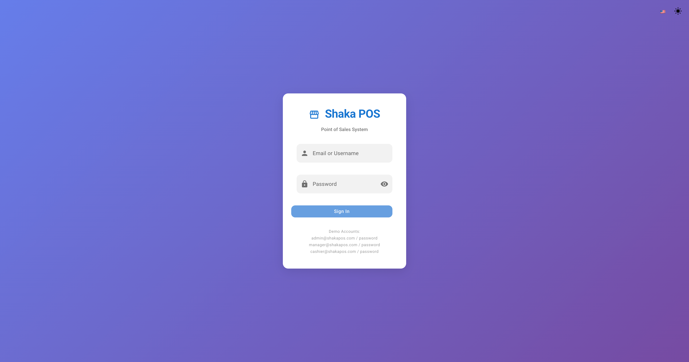
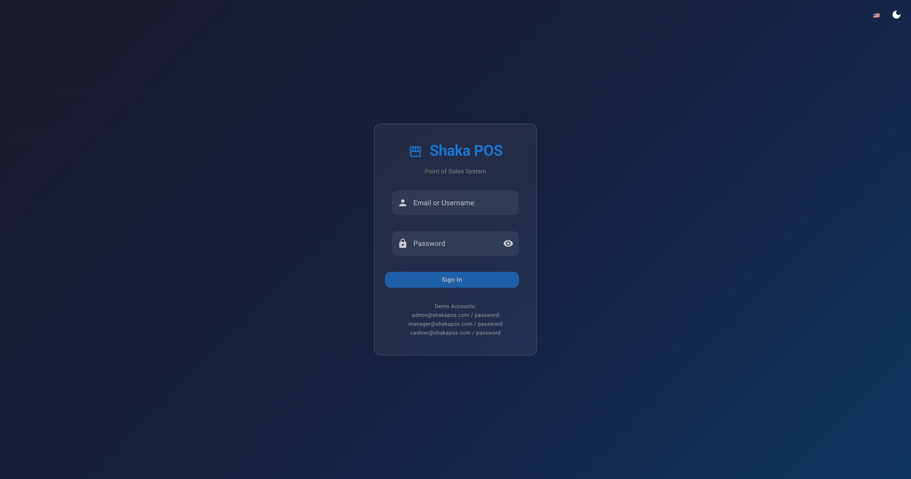
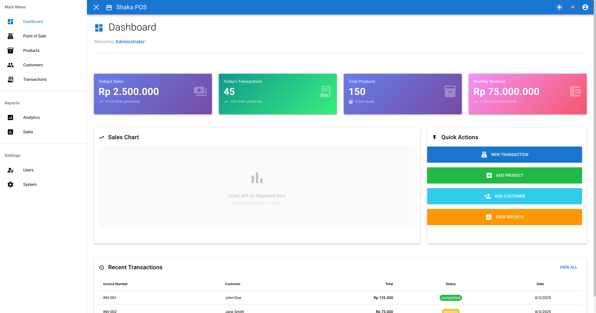
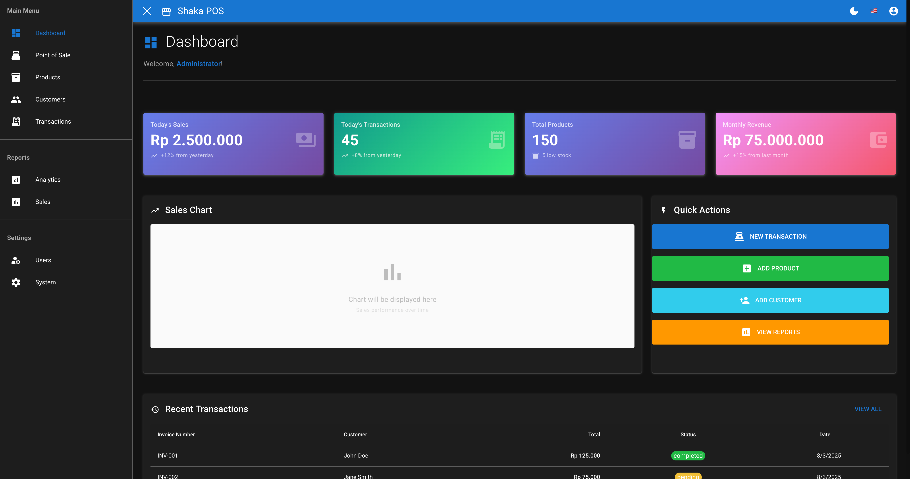

---
# 🚀 Shaka POS - Point of Sales Application

<div align="center">

[](https://laravel.com)
[](https://vuejs.org)
[](https://quasar.dev)
[](LICENSE)

## 🚦 Development Status

**Current Phase:** Sprint 1 Complete ✅ - Authentication & Foundation  
**Next Phase:** Sprint 2 - Product & Inventory + Basic Supplier + FIFO Foundation  
**MVP Target:** Week 14 (extended from Week 12 for proper FIFO implementation)


</div>

## 📋 Project Overview

Shaka POS adalah aplikasi Point of Sales (POS) modern yang dibangun dengan Laravel 12+ sebagai backend API dan Vue 3 + Quasar Framework sebagai frontend. Aplikasi ini dirancang untuk mendukung operasional toko retail dengan fitur lengkap mulai dari manajemen produk, transaksi penjualan, hingga pelaporan bisnis.

**Repository:** https://github.com/edopranata/shaka

## 🛠️ Technology Stack

### Backend
- **Framework:** Laravel 12+
- **Authentication:** Laravel Sanctum
- **Authorization:** Spatie Laravel Permission
- **Database:** MySQL/PostgreSQL
- **API Documentation:** Laravel Scribe
- **Testing:** Pest/PHPUnit

### Frontend
- **Framework:** Vue 3
- **UI Framework:** Quasar Framework
- **State Management:** Pinia
- **HTTP Client:** Axios
- **Testing:** Vitest, Cypress

### DevOps
- **Containerization:** Docker & Docker Compose
- **CI/CD:** GitHub Actions
- **Monitoring:** Laravel Telescope, Sentry

## 🏗️ Project Structure

```
shaka/
├── backend/              # Laravel API
├── frontend/             # Vue 3 + Quasar
├── docs/                 # Documentation
├── database/             # Database scripts & seeders
├── docker/               # Docker configurations
├── .github/              # GitHub workflows & templates
├── README.md
├── CHANGELOG.md
├── .gitignore
└── docker-compose.yml
```

## � Screenshots

### Authentication
<div align="center">
  
  
  <p><em>Login Page - Light Mode & Dark Mode</em></p>
</div>

### Dashboard
<div align="center">
  
  
  <p><em>Dashboard - Light Mode & Dark Mode</em></p>
</div>

## �🚦 Development Status

**Current Phase:** Sprint 1 Complete ✅ - Authentication & Foundation

### MVP Features (Week 1-12):
### MVP Features (Week 1-14):
- [x] **Sprint 1 Complete ✅** - Authentication & Foundation (August 3, 2025)
  - [x] Laravel 12 + Sanctum + Spatie Permission backend
  - [x] Vue 3 + Quasar Framework + Pinia frontend  
  - [x] Theme switcher (Light/Dark/Auto) dengan LocalStorage
  - [x] Language switcher (EN/ID) dengan flag icons
  - [x] Modern UI dengan glassmorphism effects
  - [x] Responsive design & accessibility features
  - [x] API documentation dengan Scribe
  - [x] Activity logging & audit trails
- [ ] **Sprint 2** - Product & Inventory + Basic Supplier Management
- [ ] **Sprint 3** - Purchase Management & FIFO System
- [ ] **Sprint 4** - Basic POS Interface dengan FIFO Costing
- [ ] **Sprint 5** - Store Management
- [ ] **Sprint 6** - Basic Reporting & MVP Testing

### Post-MVP Features (Week 15-20):
- [ ] Member & Advanced Pricing
- [ ] Advanced Stock Management
- [ ] Discount System & Electronic Payments
- [ ] Advanced Reporting & Analytics

## 🛠️ Quick Start

### Prerequisites
- PHP 8.2+
- Node.js 18+
- Composer
- MySQL/PostgreSQL
- Docker (optional)

### Backend Setup (Laravel)
```bash
cd backend
composer install
cp .env.example .env
php artisan key:generate
php artisan migrate
php artisan db:seed
php artisan serve
```

### Frontend Setup (Vue + Quasar)
```bash
cd frontend
npm install
npm run dev
```

### Docker Setup (Optional)
```bash
docker-compose up -d
```

## 📚 Documentation

- [📱 Visual Demo & Screenshots](./VISUAL_DEMO.md) - Comprehensive visual guide
- [API Documentation](./docs/api.md)
- [Frontend Documentation](./docs/frontend.md)
- [Deployment Guide](./docs/deployment.md)
- [Contributing Guide](./docs/contributing.md)

## 🧪 Testing

### Backend Testing
```bash
cd backend
php artisan test
```

### Frontend Testing
```bash
cd frontend
npm run test
npm run test:e2e
```

## 🔧 Environment Variables

### Backend (.env)
```env
APP_NAME="Shaka POS"
APP_ENV=local
APP_KEY=
APP_DEBUG=true
APP_URL=http://localhost:8000

DB_CONNECTION=mysql
DB_HOST=127.0.0.1
DB_PORT=3306
DB_DATABASE=shaka_pos
DB_USERNAME=root
DB_PASSWORD=

SANCTUM_STATEFUL_DOMAINS=localhost:9000
SPA_URL=http://localhost:9000
```

### Frontend (.env)
```env
VITE_API_URL=http://localhost:8000/api
VITE_APP_NAME="Shaka POS"
```
---
# SimplePOS - Laravel & Quasar Dockerized

## 🚀 Quick Start

### 1. Build & Run All Services
```bash
docker compose up --build -d
```

### 2. Check Container Status
```bash
docker compose ps
```

### 3. Run Laravel Migrations & Seeders
```bash
docker compose exec backend php artisan migrate --seed
```

### 4. Restart Backend After .env Change
```bash
docker compose restart backend
```

## 🛠️ Troubleshooting
- Pastikan port MySQL di host tidak conflict (default: 3308)
- Untuk koneksi antar container, gunakan DB_HOST=mysql dan DB_PORT=3306 di .env
- Cek log container jika ada error:
  ```bash
  docker compose logs backend
  docker compose logs mysql
  docker compose logs frontend
  ```

## 🌐 Accessing Services
- Backend API: http://localhost:8000
- Frontend: http://localhost:9000
- phpMyAdmin: http://localhost:8080

## 📦 Project Structure
- backend/: Laravel API
- frontend/: Vue + Quasar
- database/: Migration & seeder scripts
- docker/: Dockerfile & config
- docs/: Documentation
- docker-compose.yml: Service orchestration

## 📄 Documentation & Roadmap
- [project_progress_plan.md](./project_progress_plan.md)
- [CHANGELOG.md](./CHANGELOG.md)
- [DATABASE_SCHEMA.md](./DATABASE_SCHEMA.md)

---
## 🤝 Contributing

1. Fork the repository
2. Create feature branch (`git checkout -b feature/new-feature`)
3. Commit changes (`git commit -am 'Add new feature'`)
4. Push to branch (`git push origin feature/new-feature`)
5. Create Pull Request

## 📝 License

This project is licensed under the MIT License - see the [LICENSE](LICENSE) file for details.

## 👥 Team

- **Developer:** Edo Pranata
- **Project Manager:** Edo Pranata
- **Repository:** https://github.com/edopranata/shaka

## 📞 Support

For support, please create an issue in this repository or contact the development team.

---

*Last updated: August 3, 2025*
*Version: 0.1.0-alpha*
